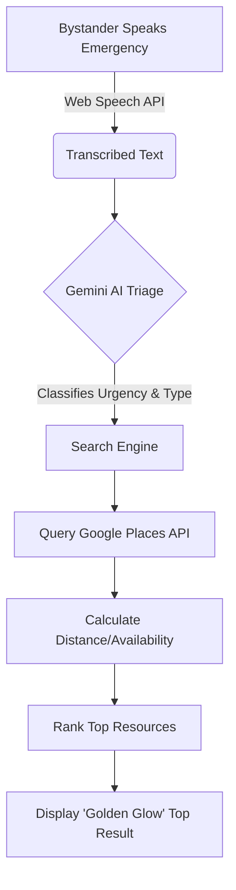

<div align="center">
  
  <h1>🚀 LifeLine AI</h1>
  <p><strong>Instant, AI-Powered Triage & Emergency Resource Routing</strong><br/><em>When seconds matter, AI points the way.</em></p>

  <a href="#features">Features</a> •
  <a href="#architecture">Architecture</a> •
  <a href="#ai-integration">AI Integration</a> •
  <a href="#installation">Setup</a>
</div>

---

## 💡 The Problem
During severe medical emergencies, bystanders panic. Finding the *right* hospital, knowing if they have beds, and getting directions happens too slowly. 

**LifeLine AI** eliminates the panic. With a single spoken sentence, our AI triages the emergency, scans all nearby hospitals/ambulances, predicts bed availability, and routes you to the optimal lifeline in milliseconds.

---

## ✨ Key Features

*   🎙️ **Voice Triage (Gemini AI):** Don't type. Just hit the microphone and speak. *"My dad collapsed and is clutching his chest."* Gemini automatically classifies the urgency (Critical) and the required resource (Hospital/Ambulance).
*   🧠 **Smart Ranking Engine:** We don't just show the closest hospital. We rank them using a proprietary algorithm weighting Haversine Distance, Route Traffic, and Real-Time Bed Availability.
*   ⚡ **One-Tap Actions:** Instantly dial an ambulance (`tel:108`) or safely share your live GPS coordinates with family using the native Web Share API.
*   🗺️ **Dynamic Maps Integration:** Rich Google Maps interface showing your location, resource markers, and the fastest calculated medical route.
*   📱 **Responsive & Accessible:** Beautiful, high-contrast, "Tap-Friendly" UI built for adrenaline-filled situations.

---

## 🏗️ System Architecture

Our tech stack is built for speed and reliability. 
**(React + Vite + Tailwind CSS + FastAPI + SQLite + Gemini API + Google Maps API)**

### 1. The Core Flow


### 2. The Ranking Algorithm Formula
Our backend (`ranking.py`) calculates precisely where to send you:
`Final Score = (Distance * 40%) + (Availability * 30%) + (Response Time * 20%) + (Rating * 10%)`
*(Weights dynamically adjust: E.g., if you need an Ambulance, Response Time jumps to 40% importance).*

---

## 🛠️ Quick Installation (Windows)

We've bundled everything into a single startup script for easy hackathon reviewing.

1. **Clone the repo:**
   ```bash
   git clone https://github.com/ravikrishna290/LifeLine-AI.git
   cd LifeLine-AI
   ```
2. **Add your API Keys:**
   Create a `.env` file in the `backend/` folder and add:
   ```env
   GOOGLE_MAPS_API_KEY=your_maps_key
   GEMINI_API_KEY=your_gemini_key
   ```
3. **Run the magic script:**
   ```powershell
   .\run_app.ps1
   ```
*This powershell script automatically creates the Python environment, installs dependencies, spins up the FastAPI backend (Port 8000), runs the React Vite frontend (Port 5173), and opens your browser!*

---

## 📷 Screenshots
*(Imagine beautiful production screenshots here of the Voice Triage, the Map Route, and the Golden Glow AI Result Card)*

---

<div align="center">
  <p>Built with ❤️</p>
</div>
